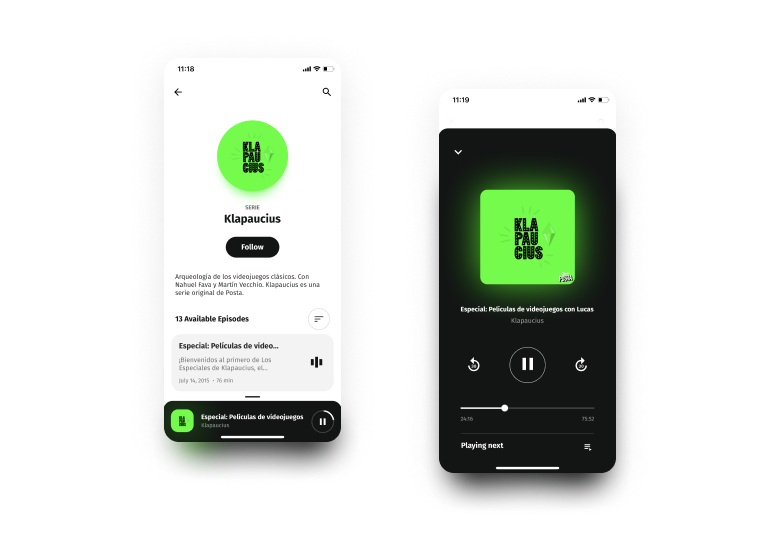

  

# [Podcasts App](https://podcast-app.vercel.app/)

Podcasts web app using Next.js and the AudioBoom API

Open [Podcasts](https://podcast-app.verce.app)

## Built with:

- Framework: [Next.js](https://nextjs.org)
  - [TypeScript](https://nextjs.org/docs/basic-features/typescript)
  - [Styled Jsx](https://github.com/vercel/styled-jsx)
  - [SWR](https://swr.vercel.app/)

## Contribution

To submit a feature, bug fix, or enhancement to the website proceed as follows:

1. Clone this repository
2. Run `yarn install` to install the dependencies
3. Once the dependencies are installed, run `yarn run dev` to start the dev server on `localhost:3000`

I really appreciate any contribution.

## License

[MIT License](https://github.com/edgarlr/podcast-app/blob/master/LICENSE).
